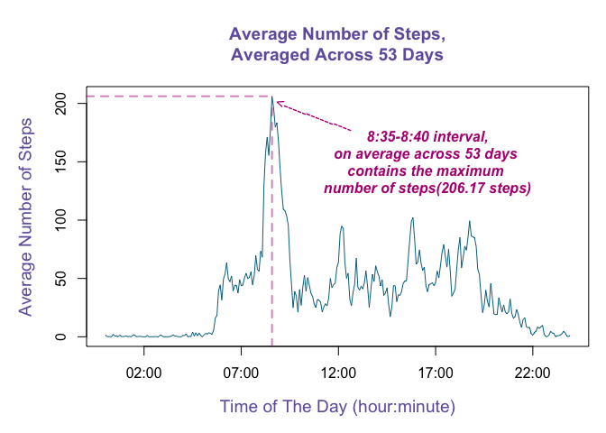
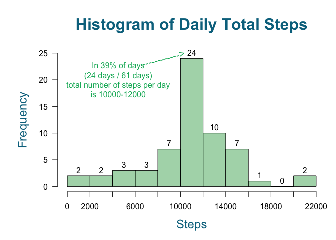
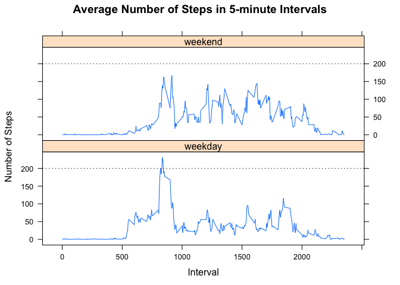

# Reproducible Research: Peer Assessment 1

## Loading and preprocessing the data

1. Read the *"activity.zip"* file into R (first unzip and then read). You should first set your working directory to the directory containing *"activity.zip"* file.
2. Convert *date* column to Date format 


```r
# 1
data <- read.csv(unzip("activity.zip"))
# 2
data$date <- as.Date(as.character(data$date), "%Y-%m-%d") 
```

## What is mean total number of steps taken per day?

1. Create a new data frame without NAs (don't need NAs for now but later we will deal with it)
2. Calculate total number of steps each day (using **plyr** package)
3. Make a histogram of the total number of steps taken each day


```r
library(plyr)

# 1
data_no_NAs <- na.omit(data)                            ## remove NAs from data frame       
# 2
total_steps_df <- ddply(data_no_NAs, .(date), 
                        summarize, steps = sum(steps))  ## make a data frame with total number of steps
# 3
par(mar = c(5,6,5,1))                                   
hist <- hist(total_steps_df$steps, col = rgb(0,0.6,0.2,0.4), breaks = 8, 
             xlab = "Steps", col.lab = colorRampPalette(c("red", "green", "blue"))(10)[8], 
             main = "Histogram of Daily Total Steps\n(NA Removed)", 
             col.main = colorRampPalette(c("red", "green", "blue"))(10)[8],
             cex.lab = 1.5, cex.main = 1.5, las = 1, labels = TRUE, xaxt = "n", ylim = c(0,17))
axis(1, at = hist$breaks)                               ## label axis with actual numbers of breaks
text(4500, 13, "In 30% of days\n(16 days / 53 days)\ntotal number of steps per day\nis 10000-12000", col = rgb(0,0.7,0.4))
text(8500, 15.5, "------------>", col = rgb(0,0.7,0.4), cex = 1.2, srt = 20)
```

<!-- -->

```r
# 4
mean <- format(round(mean(total_steps_df$steps), 2), msmall = 2)        ## calculate the mean and median and
median <- format(round(median(total_steps_df$steps), 2), msmall = 2)    ## round them to two decimal points
```
As we can see, from 53 days there are 16 days with maximum number of steps (10,000 to 12,000 steps a day).  
Mean total number of steps is **10766.19**.  
Median total number of steps is **10765**.  

**Skip the following part and go to *What is the average daily activity pattern?****  
Here is a long and time consuming way to calculate total number of steps each day (exactly the same result as the one-line code with ddply). 

```r
#data_no_NAs$rows <- c(1:dim(data_no_NAs)[1])                   ## add a column to keep track of the rows
#previous_day <- data_no_NAs$date[1]                            ## current day
#total_steps_df <- data.frame(date = as.Date(as.character()),   
#                             steps = numeric())                ## empty data.frame where we are going
#                                                               ## to collect total steps for every day
#current_steps <- 0                                             ## for collecting total steps each day
#                                                               
#for(row in data_no_NAs$rows){
#        if(data_no_NAs$date[row] - previous_day == 0){
#                current_steps <- current_steps + data_no_NAs$steps[row]
#                if(row == dim(data_no_NAs)[1]){
#                        total_steps_df <- rbind(total_steps_df,
#                                                data.frame(date = data_no_NAs$date[row-1], steps = #current_steps))
#                }
#        }
#        if(data_no_NAs$date[row] - previous_day != 0){
#                total_steps_df <- rbind(total_steps_df, data.frame(date = data_no_NAs$date[row-1],
#                                                                   steps = current_steps))
#                current_steps <- data_no_NAs$steps[row]
#        }
#        previous_day <- data_no_NAs$date[row]
#}
```


## What is the average daily activity pattern?

1. Make a new data frame called **average_steps_df** with average number of steps for each interval
2. Create a new variable for **average_steps_df** data frame called **interval_time**. We want this new variable to hold the times from **interval** column but in POSIXct format. This will later become the x-axis of our time series plot.
3. Make the time series plot using **interval_time** variable from previous step as x-axis, and average number of steps as y-axis.
4. Find which 5-minute interval, on average across all the days in the dataset, contains the maximum number of steps. We will show it as time (%H:%M format):


```r
library(lubridate)
```

```
## 
## Attaching package: 'lubridate'
```

```
## The following object is masked from 'package:plyr':
## 
##     here
```

```
## The following object is masked from 'package:base':
## 
##     date
```

```r
# 1
average_steps_df <- ddply(data_no_NAs, .(interval), summarize, average_step = mean(steps))

# 2
average_steps_df$interval_time <- sprintf("%04d", average_steps_df$interval)    ## this contains numbers from 
                                                                                ## interval variable in character
                                                                                ## form (all 4 digit)
average_steps_df$interval_time <- format(strptime(average_steps_df$interval_time, 
                                                  format="%H%M"), format = "%H:%M")     ## still characters
                                                                                        ## but in %H:%M format                                                                    
average_steps_df$interval_time <- as.POSIXct(average_steps_df$interval_time, format="%H:%M") ## POSIXct (perfect)


# 3
par(mar = c(5,5,5,1))
plot(average_steps_df$interval_time, average_steps_df$average_step,
     xlab = "Time of The Day (hour:minute)", ylab = "Average Number of Steps",
     col = colorRampPalette(c("red", "green", "blue"))(10)[8],
     col.lab = colorRampPalette(c("red", "green", "purple"))(15)[13], 
     cex.lab = 1.2, type = "l")
title(main = "Average Number of Steps,\nAveraged Across 53 Days",
      col.main = colorRampPalette(c("red", "green", "purple"))(15)[13])

# 4
max_steps <- max(average_steps_df$average_step)
max_steps_time <- 
        average_steps_df[average_steps_df$average_step == max_steps,]$interval_time     ## time in day with
                                                                                        ## maximum average
                                                                                        ## number of steps
max_steps_time_char <- paste(hour(max_steps_time), minute(max_steps_time), sep = ":")

# Extra: add the previous point to the time series plot
axis(1, at = max_steps_time, 
     labels = FALSE, col.ticks = rgb(0.7,0,0.5, 0.5),
     tck = 0.94, lty = 2, lwd = 2)
axis(2, at = max_steps, labels = FALSE, col.ticks = rgb(0.7,0,0.5, 0.5), 
     tcl = 10.5, lty = 2, lwd = 2)

# Extra: add text to the plot explaining what the above point is
text(average_steps_df$interval_time[200], 150, labels = sprintf("8:35-8:40 interval,\non average across 53 days \ncontains the maximum \nnumber of steps(%g steps)", max_steps), col = rgb(0.7,0,0.5), font = 4)
text(average_steps_df$interval_time[130], 190, labels = "<---------------", col = rgb(0.7,0,0.5), srt = -20)
```

<!-- -->

Average number of steps across all days is reached in **8:35** interval (**max_steps_time_char** variable in above code).

## Imputing missing values

1. Calculate total number of missing values in the dataset.  
2. Creat a new data frame called **data_new** similar to the data frame **data** but NAs replaced with average number of steps of that 5-minute interval. This [post on stackoverflow](https://stackoverflow.com/questions/24847299/using-ifelse-to-replace-nas-in-one-data-frame-by-referencing-another-data-fram) is exactly what we need for this task.  
3. Make a histogram of total number of steps taken each day.  
4. Calculate **mean** and **median** total number of steps taken each day.  


```r
# 1
missing_values <- sum(is.na(data$steps))                        ## number of missing values in dataset

# 2
data_new <- data
data_new$steps[is.na(data_new$steps)] <-
        average_steps_df$average_step[match(data_new$interval[is.na(data_new$steps)],average_steps_df$interval)]

# 3
total_steps_df1 <- ddply(data_new, .(date), summarize, steps = sum(steps))      ## new data frame with total 
                                                                                ## steps per day

par(mar = c(5,6,5,1))                                   ## Make left side of the plot, bottom and the top bigger
hist <- hist(total_steps_df1$steps, col = rgb(0,0.6,0.2,0.4), breaks = 8, 
             xlab = "Steps", col.lab = colorRampPalette(c("red", "green", "blue"))(10)[8], 
             main = "Histogram of Daily Total Steps", 
             col.main = colorRampPalette(c("red", "green", "blue"))(10)[8],
             cex.lab = 1.5, cex.main = 2, las = 1, labels = TRUE, xaxt = "n", ylim = c(0,25))
axis(1, at = hist$breaks)                               ## annotate axix with actual breaks' numbers

text(4500, 20, "In 39% of days\n(24 days / 61 days)\ntotal number of steps per day\nis 10000-12000",
     col = rgb(0,0.7,0.4))
text(8500, 24, "------------>", col = rgb(0,0.7,0.4), cex = 1.2, srt = 15)
```

<!-- -->

```r
# 4
mean1 <- format(round(mean(total_steps_df1$steps), 2), msmall = 2)
median1 <- format(round(median(total_steps_df1$steps), 2), msmall = 2)
```

There are 2304 **missing values**.  
After filling in the missing values, the **mean** total number of steps is **10766.19** and the **median** total number of steps is **10766.19**.

As we see, the mean total number of steps in dataset with replaced NAs is exactly the same as the mean total number of steps in the dataset with removed NAs. The median, however, is different (well, slightly different) and this time it is equal to the mean total number of steps.

### Explanation on why the mean values are equal

The two reasons are **unique positions of missing values** and the **strategy to replace missing values**.


#### Unique position of missing values

It's simple. Each day in the dataset either has **all** values present or **all** values missing. The code for finding this out is the following.


```r
data_NA_check1 <- ddply(data, .(date), summarize, answer = all(is.na(steps)))   ## find days with all NAs
data_NA_check2 <- ddply(data, .(date), summarize, answer = any(is.na(steps)))   ## find days with any NA
identical(data_NA_check1, data_NA_check2)        
```

```
## [1] TRUE
```
Returned **TRUE** value means that if there is a day in dataset with at least one NA, than all other values of that day are also NAs.

#### Strategy to replace missing values

Let's say we now take one of the days that has NAs for all intervals. We can call it **Lazy_day**.
We take each interval of this Lazy_day and replace its missing steps. The replacing value is calculated by the following way.   

1. For interval 0-5 of Lazy_day, we look at all other 0-5 intervals in dataset (ignoring, of course, intervals where number of steps is missing).   
2. We calculate the mean number of steps in these other 0-5 intervals. This mean value becomes the number of stepsn in 0-5 interval for Lazy_day.  
3. We repeat steps 1 and 2 for all intervals of Lazy_day and then for other NA-valued days.


#### Example  

Here is a simple example showing how the mean value of a dataset with missing values removed is the same as the mean value of that same dataset with missing values imputed (for above described **unique positions** and the **strategy to replace missing values**). 

Let's say we have a dataset with 4 days (dayA, dayB, dayC, Lazy_day) and 3 intervals (0-5, 5-10, 35-40). 

   |                  |       dayA       |       dayB       |        dayC       |Lazy_day| 
   |      ----        |       ----       |       ----       |        ----       |  ----  |
   |**Steps in 0-5**  |        A1        |        B1        |         C1        |   NA   |
   |**Steps in 5-10** |        A2        |        B2        |         C2        |   NA   |
   |**Steps in 35-40**|        A3        |        B3        |         C3        |   NA   |
   |**Total Steps**   | A = A1 + A2 + A3 | B = B1 + B2 + B3 | C = C1 + C2 + C3  |  ____  |

  
##### First, we will calculate mean total number of steps after removing NA values. 

* **Remove NAs**  

     |                  |        dayA      |       dayB       |       dayC        |  
     |      -----       |        ----      |       ----       |       ----        |
     |**Steps in 0-5**  |         A1       |        B1        |        C1         |
     |**Steps in 5-10** |         A2       |        B2        |        C2         | 
     |**Steps in 35-40**|         A3       |        B3        |        C3         | 
     |**Total Steps**   | A = A1 + A2 + A3 | B = B1 + B2 + B3 | C = C1 + C2 + C3  |

  
* **Calculate the mean total number of steps**  

        mean(A, B, C) = (A + B + C)/3

##### Now we will calculate mean total number of steps but this time with NA values filled in. 


* **Fill in NAs**  

     |                  |       dayA      |       dayB     |     dayC       |   Lazy_day           | 
     |   -----------    |--------------   |  ------------- | ------------   |----------------------|
     |**Steps in 0-5**  |        A1       |        B1      |      C1        |   (A1 + B1 + C1) / 3 |
     |**Steps in 5-10** |        A2       |        B2      |      C2        |   (A2 + B2 + C2) / 3 |
     |**Steps in 35-40**|        A3       |        B3      |      C3        |   (A3 + B3 + C3) / 3 |
     |**Total Steps**   |A =  A1 + A2 + A3|B = B1 + B2 + B3|C = C1 + C2 + C3| (A1 + B1 + C1) / 3 + (A2 + B2 + C2) / 3 + (A3 + B3 + C3) / 3 = (A1 + A2 + A3) / 3 + (B1 + B2 + B3) / 3 + (C1 + C2 + C3) / 3 = (A + B + C) / 3 = mean(A, B, C)

* **Calculate the mean total number of steps**  

        mean(A, B, C, D) = (A + B + C + D) / 4 = (A + B + C + mean(A,B,C)) / 4 =   
                         = (A + B + C + (A + B + C)/3) / 4 = (4/3 * (A + B + C)) / 4 =  
                         = (A + B + C) / 3 = mean(A, B, C)  
                    
##### Result 

        mean(A, B, C, D) = mean(A, B, C)

And, of course, this result will be achieved with more days (both NA days and non_NA days).


### Explanation on why the medians are different (slightly different)

There are **61** days in our dataset. **8** days have missing values (**calculated below**). 

When we removed missing values, we were left with **53** days. For these 53 days the mean total number of steps was **10766.19**, which is in **10000-12000** interval. This interval contained **16** values. 

By imputing missing values we actually took this mean value of **10766.19** and made it the **total number of steps** for each of those 8 NA-days. So now we have **8** values each equal to **10766.19** in **10000-12000** interval together with the other **16** values. And as the **median** with removed NAs was also in **10000-12000**, by adding 8 values to 10000-12000, we made the new median fall on one of these **10766.19** values.


```r
length(unique(data$date)) - length(unique(data_no_NAs$date))
```

```
## [1] 8
```


## Are there differences in activity patterns between weekdays and weekends?   

1. Create a new factor variable in the dataset with two levels – “weekday” and “weekend” indicating whether a given date is a weekday or weekend day.   
2. Make a new data frame with the average number of steps for each interval, averaged across all weekday days or weekend days (using **dplyr** package)  
3. Make the conditional plot using **lattice** package    


```r
library(lattice)
library(dplyr)
```

```
## 
## Attaching package: 'dplyr'
```

```
## The following objects are masked from 'package:lubridate':
## 
##     intersect, setdiff, union
```

```
## The following objects are masked from 'package:plyr':
## 
##     arrange, count, desc, failwith, id, mutate, rename, summarise,
##     summarize
```

```
## The following objects are masked from 'package:stats':
## 
##     filter, lag
```

```
## The following objects are masked from 'package:base':
## 
##     intersect, setdiff, setequal, union
```

```r
# 1
data_new$weekdays <- with(data_new, 
                          ifelse(weekdays(date) != "Saturday" & weekdays(date) != "Sunday",
                                 "weekday", "weekend"))
data_new$weekdays <- as.factor(data_new$weekdays)

# 2
data_new_df <- data_new %>% 
        group_by(interval, weekdays) %>% 
        summarise(average_steps = mean(steps)) 
# 3
with(data_new_df,
     xyplot(average_steps ~ interval | weekdays, layout = c(1, 2),
            xlab = "Interval",ylab = "Number of Steps", 
            main = "Average Number of Steps in 5-minute Intervals",
            panel = function(x, y, ...){
                    panel.xyplot(x, y, type = "l")
                    panel.abline(h = 200, lty = "dotted")
            }))
```

<!-- -->

From the plot we see that during weekdays the maximum average number of steps is bigger (more than **200** steps) than the maximum average number of steps during weekends (less than **200** steps).   
But we also see that during weekends there are more peaks on the plot and it seems that during those days more walking is done. Below is the code that proves it.


```r
data_new_total_steps <- data_new %>% group_by(date, weekdays) %>% 
        summarise(total_steps = sum(steps))
data_new_total_steps %>% group_by(weekdays) %>% 
        summarise(average_total_steps = mean(total_steps))
```

```
## # A tibble: 2 × 2
##   weekdays average_total_steps
##     <fctr>               <dbl>
## 1  weekday            10255.85
## 2  weekend            12201.52
```

